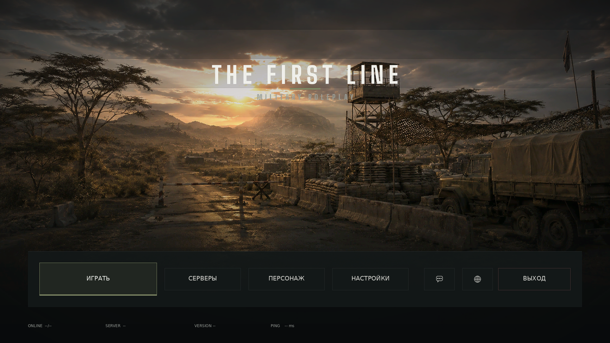

# TFM_MENUGAME_UI — интерфейс DayZ по хендоффу THE FIRST LINE | MILITARY RP

Клиентский мод: полная замена визуальной части интерфейса по
`docs/DESIGN_HANDOFF.md`. Все 14 экранов ТЗ, `.layout` и `.paa` включены —
собирать текстуры вручную не нужно.

Ванильные меню не переписываются: `super.Init()` отрабатывает как обычно
(логика профиля, персонажа, серверов, очереди жива), после чего ванильные
виджеты скрываются, а поверх ложится наш layout. Если layout не загрузится —
ванильный экран возвращается на место, чёрного экрана не будет.



Остальные экраны — `docs/preview/`. Это оффлайн-рендер самих `.layout`
(`tools/preview_layout.py`), а не скриншоты игры: шрифт подставной,
поэтому кегли приблизительные, а геометрия и цвета — точные.

## Экраны

| # | Экран | id | Layout | Контроллер |
|---|---|---|---|---|
| 01 | Главное меню | 5a | `main_menu.layout` | `TFMMainMenu.c` |
| 02 | Hover + tooltip | 5b | там же | `TFMTooltip.c` |
| 03 | Загрузка | 6a | `loading_screen.layout` | `TFMLoadingView.c` |
| 04 | Загрузка, центрированная | 8b | `loading_centered.layout` | там же |
| 05 | Очередь на сервер | 6b | `server_queue.layout` | `TFMQueueView.c` |
| 06 | Таймер входа | 6c | `timer_panel.layout` | `TFMTimerView.c` |
| 07 | Таймер респавна | 6c | там же (режим RESPAWN) | там же |
| 08 | Hint card | 8a | `hint_card*.layout` ×3 | `TFMHintCard.c` |
| 09/10 | Диалоги | 7a | `dialog.layout` | `TFMDialogMenu.c` |
| 11–14 | UI-kit / состояния / прогресс / ассеты | 7b, 4a, 8b, 8d | — | `TFMTheme.c`, `TFMMenuButton.c`, `TFMProgressBar.c` |
| — | Панель раздела | 8c | `section_panel.layout` | `TFMSectionPanel.c` |

Листы 11–14 — не экраны, а спецификации; они реализованы как код: токены в
`TFMTheme`, матрица состояний в `TFMMenuButton`, прогресс в `TFMProgressBar`.

## Структура

```
TFM_MENUGAME_UI/
  $PBOPREFIX$                     TFM_MENUGAME_UI
  config.cpp
  GUI/Layouts/*.layout            10 файлов — генерируются, см. tools/
  GUI/textures/*.paa              11 текстур — генерируются, см. tools/
  GUI/textures/_source/           исходные PNG фонов (в PBO не нужны)
  Scripts/5_Mission/TFM/          14 файлов Enforce Script
tools/
  gen_layouts.py     все .layout из пиксельной геометрии хендоффа
  gen_textures.py    заливка, логотипы, иконки, виньетка -> .paa
  png_to_paa.py      PNG -> PAA (DXT1/DXT5), для фонов
  preview_layout.py  оффлайн-рендер .layout в PNG
  build_mod.py       сборка @TFM_MENUGAME_UI + zip с проверкой PBO
  pack_pbo.py, list_pbo.py, sha256_file.py   (из WorkKit)
docs/
  DESIGN_HANDOFF.md  исходный дизайн-хендофф
  preview/           рендеры экранов
```

Layout'ы и текстуры лежат в репозитории готовыми — генераторы нужны только
чтобы что-то поменять. Пересборка:

```
python3 tools/gen_textures.py
python3 tools/gen_layouts.py
```

## Настройка

`$profile:TFM_MENUGAME_UI/menu_config.json` создаётся с дефолтами при первом запуске и
правится без пересборки PBO:

```json
{
  "ServerName": "THE FIRST LINE | MILITARY RP",
  "ServerIP": "203.0.113.10",
  "ServerPort": 2302,
  "ServerPassword": "",
  "DiscordURL": "https://discord.gg/...",
  "WebsiteURL": "https://...",
  "StatusLine": "THE FIRST LINE | MILITARY RP  ·  CHERNARUS",
  "VersionLabel": "1.0.0",
  "CenteredLoading": false
}
```

`CenteredLoading: true` — центрированная раскладка загрузки (id 8b) для
3440×1440 и 4K.

**ИГРАТЬ** делает прямой коннект на этот адрес. Пока `ServerIP` дефолтный
(`127.0.0.1`) — открывается обычный браузер серверов, чтобы меню работало
«из коробки».

## Сборка

```
python3 tools/build_mod.py
```

Собирает `build/@TFM_MENUGAME_UI/` и `build/TFM_MENUGAME_UI_mod.zip`: стейджинг без
`GUI/textures/_source/` (исходные PNG в PBO не нужны), упаковка PBO и
проверка — PBO распаковывается обратно, файлы сверяются с исходными,
контролируется SHA1-подпись в хвосте.

Положить `@TFM_MENUGAME_UI` рядом с DayZ и запустить с `-mod=@TFM_MENUGAME_UI`.

`$PBOPREFIX$` = `TFM_MENUGAME_UI`, поэтому пути в layout — `TFM_MENUGAME_UI/GUI/textures/...`.
Никаких `P:/`, `C:/`, `D:/`.

## Как это устроено (три грабли DayZ, на которых легко потерять день)

Правила взяты из рабочего мода JobsMod (`DogStay/modik4`) и его
`DAYZ_MODDING_REFERENCE.md`; генераторы соблюдают их автоматически.

1. **Цвет в `.layout` — RGBA, в скрипте — ARGB.** Записанный альфа-первым
   тёмный цвет получает альфой свой синий канал (`#16181A` → `0.102`) и
   панель просто исчезает, без единой строчки в логе. Проверка:
   `grep -hE '^\s*color\s' TFM_MENUGAME_UI/GUI/Layouts/*.layout | awk '{print $NF}' | sort | uniq -c`
   — должны преобладать `1` и `0`.
2. **`hexactpos` / `vexactpos` / `hexactsize` / `vexactsize` = 0.** Без них
   движок читает `position`/`size` как пиксели, и вся вёрстка уезжает.
3. **`PanelWidget` не рисует заливку.** Цвет несёт `ImageWidget` с белой
   текстурой `ui_fill.paa`, тонируемой через `color`. Отсюда же слоистая
   структура кнопки: `border` (вся площадь) → `fill` (врезка 1px) →
   `mark` (4px снизу) → `label`/`icon`. Скрипт красит эти слои по именам.

Следствие, о котором стоит знать: заливка PRIMARY посчитана заранее
непрозрачной (`#222622` = olive 16% на панели). Полупрозрачный olive поверх
olive-границы залил бы кнопку целиком — граница лежит под заливкой во всю
её площадь.

## Текстуры

Все `.paa` сгенерированы и лежат в репозитории:

| Файл | Что | Формат |
|---|---|---|
| `ui_fill.paa` | белая заливка 32×32 для панелей, границ, марок, градиентов | DXT5 |
| `mainmenu_background.paa` | фон главного меню 2048×1024 | DXT1 |
| `loading_background_01..04.paa` | фоны загрузки и очереди | DXT1 |
| `logo_main.paa`, `logo_small.paa` | логотипы (по ассет-листу 8d) | DXT5 |
| `icon_discord.paa`, `icon_website.paa` | иконки 64×64 | DXT5 |
| `digits/d0..d9, dcolon, dslash` | глифы крупных чисел 64×128 | DXT5 |
| `vignette.paa` | радиальная виньетка | DXT5 |

Контейнер PAA в `png_to_paa.py` воспроизведён побайтово с рабочего файла из
JobsMod (magic, пустой блок тэгов, один мип, терминатор) — заголовок
совпадает бит в бит. Фоны кодируются DXT1 при PSNR ≈ 37 dB. Если нужен
максимум качества — те же PNG из `_source/` можно переконвертировать в
TexView 2, имена файлов менять не нужно.

Градиенты собраны полосами, а не отдельной текстурой; `blur` (6px в очереди,
8px в диалогах) движком UI не даётся и компенсирован затемнением.

## Что осталось проверить под свой билд

Одно место, а не список:

**`TFMIntegration.c`** — единственный файл, который трогает ванильные классы
(`LoadingScreen`, `LoginQueueBase`, `LoginTimeBase`, `RespawnDialogue`). Их
имена и сигнатуры менялись между версиями DayZ. Если компилятор ругается —
правится или удаляется только он: вьюхи самодостаточны, главное меню не
сломается. Внутри три места ждут вызовов вашего билда:

- `TFMSetProgress` — реальный прогресс загрузки;
- `TFMSetPosition` / `TFMSetTime` — позиция в очереди и отсчёт;
- в `RespawnDialogue.OnClick` — вызов ванильного респавна (наш
  `ButtonWidget` не тот, на который завязан оригинальный обработчик).

Плюс `g_Game.ConnectFromServerBrowser(...)` в `TFMMainMenu.TFMPlay()` —
сверить с `scripts/5_Mission/gui/ServerBrowser`.

**Про кегль текста.** В layout стоят два шрифтовых ресурса, существование
которых подтверждено рабочим модом: `gui/fonts/etelkatextpro22` и
`gui/fonts/metron-bold14`. Имена шрифтов больших кеглей подтвердить не
удалось, а выдуманное имя даёт невидимый текст. Поэтому всё крупное набрано
текстурами и от игровых шрифтов не зависит: логотипы, а также таймер 92px и
позиция в очереди 88px — они собираются из глифов `GUI/textures/digits/`
(`TFM_Digits`, слоты раскладывает `digit_row` в генераторе; ширина слота
одинаковая — это tabular-nums из спеки).

Текстом остаётся то, что в хендоффе идёт кеглем 20–40 (заголовки панелей,
подписи, кнопки, статус-бар, процент загрузки).

**Высота текстового виджета задаёт кегль строки.** Поэтому бокс равен
кеглю и центрируется в отведённом месте, а не растягивается на всю строку —
иначе буквы упираются в края и выглядят несоразмерно крупными. Вся шкала
собрана в одну таблицу `TYPE_SIZE` в `tools/gen_layouts.py`: она повторяет
типографику хендоффа (SUBTITLE 30 · BUTTON 32 · BODY 26 · SMALL 20), и
кегль правится там, а не по месту в десяти файлах.

## Решения, которые я принял сам

- **Вертикальная раскладка низа главного меню.** В спеке `action_bar`
  «отступ снизу 80», `status_bar` «отступ снизу 21» и «зазор до ленты 24» —
  три условия не сходятся (80 + 176 + 24 + 68 > 1080 снизу). Взята привязка
  к низу экрана: status_bar 21 от низа, зазор 24 → `action_bar.y = 791`.
- **Ширина вторичных кнопок 240 вместо 260.** С 260 лента переполняется на
  67px: `36 + 370 + 24 + 3×(260+24) + 1 + 24 + 2×(96+24) + 228 + 36 > 1744`.
- **Скрим сверху** (0→45% на высоте 460) — в спеке его нет, но логотип
  ложится на закатное небо и без затемнения теряет контраст.
- **Панель раздела открывается только для «СЕРВЕРЫ».** «ПЕРСОНАЖ» и
  «НАСТРОЙКИ» ведут в ванильные меню: пустая красивая панель хуже рабочих
  настроек. Компонент универсальный — переключается одной строкой в
  `TFMMainMenu.OnClick`.
- **Список серверов** — сейчас одна строка из конфига. Точка подстановки
  реального списка: `TFMMainMenu.TFMBuildServerRows()`.
- **Диалоги показываются через `UIManager.ShowScriptedMenu`**, а не через
  собственный `MENU_*` id — не требует регистрации в фабрике меню.

## Осталось за рамками

- Два арта фона по ТЗ ещё не нарисованы (отдельный loading с разрушенным
  городом, лесной военный лагерь) — в хендоффе они тоже помечены как
  недоделанные.
- 9-patch и StatePAA: панели собраны цветными слоями, а не растянутыми
  углами. Визуально совпадает, но при желании ассет-лист 8d заменяется на
  настоящие 9-patch без правки скриптов — слои уже разведены по именам.
- Шум 5% поверх фона.
- Focus-рамка для геймпада: состояние в `TFMMenuButton` заложено, отдельный
  виджет рамки не добавлен.
